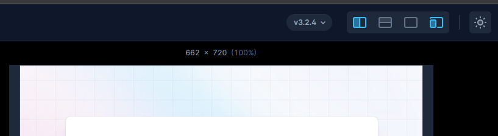

# Uno Design

This is an UI Components Library build by `Vite3`,`TypeScript`,`Vue3`,`Vitest` and  `Sass`.

## Technology Stack

核心库版本及使用说明

| 技术       | 版本 | 说明     | 官网 |
| ---------- | ---- | -------- | ---- |
| Vite       | 3.2  | 构建工具 |      |
| Vue        | 3.2  | 核心库   |      |
| TypeScript | 4.6  | 类型校验 |      |
| Vitest     | 0.24 | 测试工具 |      |
| Sass       | 1.55 | 样式工具 |      |

其他版本库说明

| Name                 | Description                  | Document Address |
| -------------------- | ---------------------------- | ---------------- |
| @antfu/eslint-config | 格式化校验库，可以自动格式化 |                  |
|                      |                              |                  |

## About `Turbo`

这里主要方便运行散落到各个 `packages` 的脚本

官网看 [这里](https://turbo.build/repo/docs/core-concepts/monorepos/running-tasks "Defining a pipeline")

详细的使用方法可以参考 [配置](https://juejin.cn/post/7048234698048274469 "Turborepo: 是时候给你的monorepo仓库上上对抗了")

## Development Plan

* [ ] 搭建组件库文档
  * [ ] 使用 vitepress 搭建基础文档，目标是有基本的参数说明，组件可预览
  * [ ] 研究 vitdoc 希望实现组件文档实时生成的功能
  * [ ] 将 vitepress 与 vitdoc 结合，做到自动生成可预览可交互有详细说明的组件文档库
  * [ ] 支持多种形式的 Code Demo, 如 JS，TS，Vue2, Vue3
  * [ ] 支持多种演示方式，如 CodePen，CodeSandbox 等平台， 可以研究 [案例](https://codesandbox.io/s/6yznjvl7nw?file=/index.js:31-42 "通过调用API方式创建沙箱") [思路](https://blog.csdn.net/w20101310/article/details/120136460 "Antd中示例代码是怎么直接在CodeSandBox中打开的")
* [ ] 搭建 Playground
  * [ ] 定制改变布局的功能，研究 TailwindCSS 的 Playground 平台

    
* [ ] 样式库分离
  * [ ] 受到 daisyui 启发，可以为 unocss 搭建一套预设作为样式库
  * [ ] 有精力可以尝试原生 CSS 变量来搭建样式库
  * [ ] 主题自定义方案 [参考](https://dev.daisyui.com/theme-generator/ "daisyui 主题生成")
