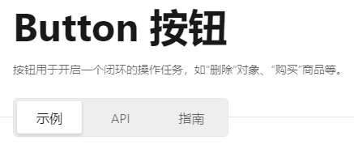
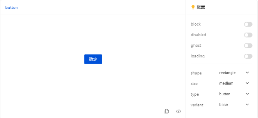
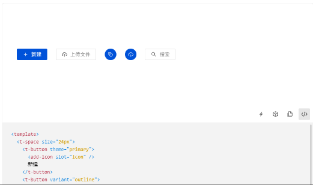
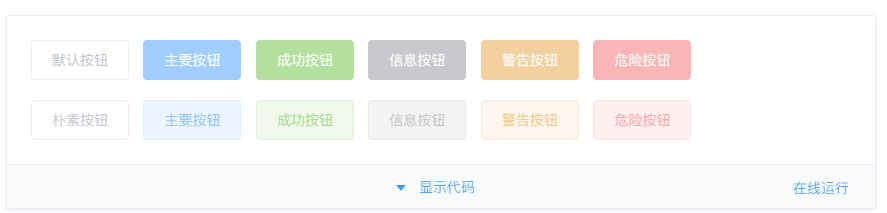
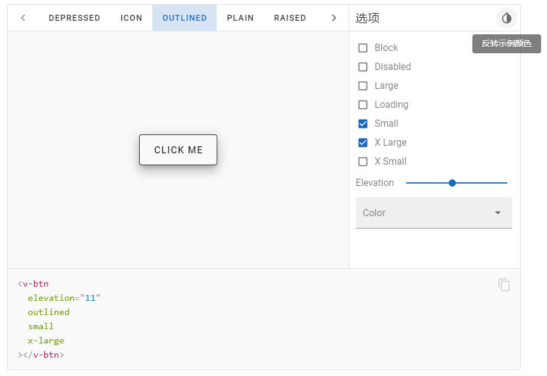
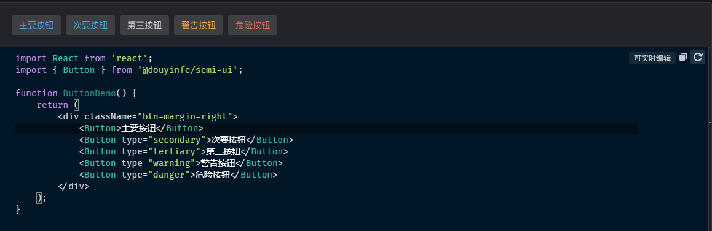

# 演示文档

每一款优秀的组件库都必然有一套完善的演示文档。在我看来，演示文档担任着举足轻重的作用，并且它的价值还有待进一步挖掘。

我研究我很多组件库，其中最关注的就是文档的组织方式，如何帮助使用者更快的掌握每个组件的使用方法？我觉得着点尤其重要。

## 常见的组件库

* [Semi Design](https://semi.design/zh-CN/)
* [Fluent UI - Get started - Fluent UI (microsoft.com)](https://developer.microsoft.com/en-us/fluentui#/)
* [Naive UI: 一个 Vue 3 组件库](https://www.naiveui.com/zh-CN/os-theme)
* [Element - 网站快速成型工具](https://element.eleme.io/#/zh-CN)
* [Arco Design - 企业级产品的完整设计和开发解决方案](https://arco.design/)
* [Vant 3 - 轻量、可靠的移动端组件库 (vant-ui.github.io)](https://vant-ui.github.io/vant/#/zh-CN)
* [MUI: The React component library you always wanted](https://mui.com/zh/)
* [Fluent UI - Get started - Fluent UI (microsoft.com)](https://developer.microsoft.com/en-us/fluentui#/)
* [Vuetify — A Material Design Framework for Vue.js (vuetifyjs.com)](https://vuetifyjs.com/zh-Hans/)
* [Fighting Design | Fighting Design (tianyuhao.cn)](https://fighting.tianyuhao.cn/)
* [Free Open Source Tailwind CSS Components | HyperUI](https://www.hyperui.dev/)
* [uView 2.0 - 全面兼容nvue的uni-app生态框架 - uni-app UI框架 (uviewui.com)](https://www.uviewui.com/)
* [TDesign - 开源的企业级设计体系 (tencent.com)](https://tdesign.tencent.com/)
* [Zan Design System - 有赞设计语言系统 - 服务于 SaaS 产品的产品设计体系 (youzan.com)](https://design.youzan.com/)
* [Taro UI | O2Team (jd.com)](https://taro-ui.jd.com/#/)

吓我一跳！居然有这么多组件库！

## 展望

经过对各个组件库的对比研究，组件库在功能上大致有：

- 首页介绍 - 让使用者对组件库整体有一个了解
- 快速入门 - 帮助用户快速安装组件，并应用于自己的项目。
- 基础组件 - 分别对各个组件的属性参数、使用方法和表现形式进行详细说明
- 组件概览 - 在一个页面中展示所有组件的缩略图，方便用户预览各个组件的样式
- 设计资源 - 一般包括组件主题的设计理念和设计资源包（**Figma | Adobe XD | Sketch | Axure**）
- 主题生成器 - 用于生成不同风格的组件主题，一般是通过修改变量来实现。修改内容包括颜色、边框、间距、字体、圆角这类通用属性。
- 组件预览 - 预览不同属性参数下组件的表现样式。一般还有代码展开、复制、重置代码、重置焦点、跳转源码、语言切换、主题切换、三方平台跳转（CodeSandbox、StackBlitz、CodePend）
  - 简单预览 - 预览 + Demo
  - 可编辑预览 - 预览 + 可编辑的Demo
  - 可交互预览 - 预览 + 预设的组件属性，可直接通过表单配置
- 工具栏 - 主题切换、导航、搜索、展开所有代码、框架切换、语言切换、中英文切换、屏幕切换、GitHub跳转

**根据我的探索，[TDesign](https://0_49_6-tdesign-vue.surge.sh/) 是以上功能的集大成者，[Semi Design](https://semi.design/zh-CN/) 稍逊风骚。**

除了功能齐全外，它们都比较合理的安排了各个功能。如 示例、API文档、设计文档、指南的快速切换、不同组件预览方式的配合、中肯的组件使用指南。

另外 **HyperUI** 是一个比较另类的组件库，它几乎只有样式上的表现，文档中切换不同屏幕尺寸的功能让人耳目一新。

## 附件

- 简单预览 [Vant 3](https://vant-ui.github.io/vant/#/zh-CN) | [Eelement UI](https://element.eleme.io/#/zh-CN/component/button)

  
- 可交互预览 [vuetify](https://vuetifyjs.com/zh-Hans/components/buttons/#section-57577ea7630994ae)

  

- 可编辑预览 [semi design](https://semi.design/zh-CN/input/button)

